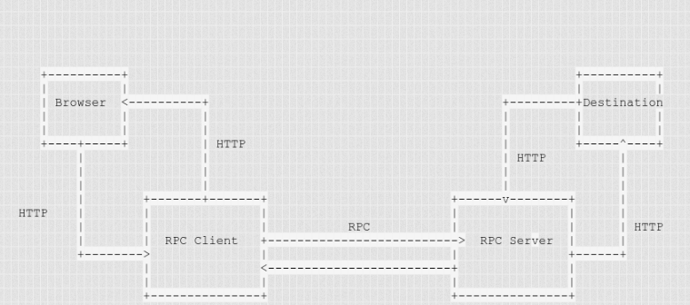

# Firefox proxy appling RPC protocol
This project is a part of my final project for Distributed System course. It provides a simple daemon for intermediate machine to transfer data between source and destinate machine. It support firefox proxy interface to communicate with the firefox browser. The program is written in C language

# Mechanism
The project splited into 2 nodes, first node will receive request from input machine (browser) then send request to second node which in turn will send request to the destinate server. It is combined into a pipe from the browser to server. In there, there are at least 2 nodes serve as the tunnel for 2 ends of pipe.

In this techonology, the tunnel machine speak with the end user in pure HTTP(s) and communicate with another tunnel machine by RPC protocol. This tunnel is 1 direction tunnel. The tunnel begin from end point where send request out and reach the rest point which is considered as response point. This tunnel finishes when any end point of pipe closes its socket.